# Dom Manipulation Assignment

# 1. Webiste Name: [Dev To](https://dev.to/)

### Topics

    - Query Selctory, Inner HTML

### Sample Image


### Tasks

        Target the Top description div and change the DEV Community to <Your_Name> and description to your passion

### Output


### Code
```
const sidebar = document.querySelector(".side-bar .crayons-card");

const tittle = sidebar.querySelector(".crayons-subtitle-2").innerHTML = "Hirenkumar"

const passion_desc = sidebar.querySelector("p");

passion_desc.innerHTML = "I create awsome web applications with the help of JavaScript language.
```
### Result
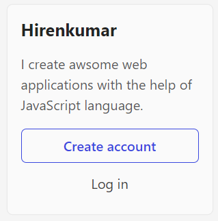

# 2. Website Name: [Apple](https://support.apple.com/en-in)

### Task


### Fetch all the product name and store in an array

### Output

['iPhone', 'Mac', 'iPad', 'Watch', 'AirPods', 'Music', 'TV']

### Code
```
const devices = document.querySelector(".as-imagegrid .row");

const deviceChild = devices.children;

const Array = [];

for (const i of deviceChild) {
    const deviceName = i.getElementsByTagName("a")[0].getAttribute("data-analytics-link-component_name");
    Array.push(deviceName);
}
console.log(Array);

```
### Result
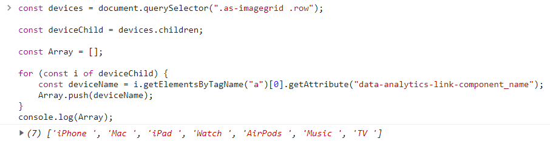


# # 3. Webiste Name: [Youtube Support](https://support.google.com/youtube/)

### Topics

    - Get Element By Id, Create Element, Create Text Node, Append Child

### Sample Image


### Tasks

     Add another FAQ 'My New FAQ' to the list

### Output


### Code
```
const accordian = document.querySelector(".accordion-homepage");

const mynewFaQ = document.createElement("section")
mynewFaQ.setAttribute("class", "parent")

const faq = document.createElement("h3")
faq.innerText = "My New FAQ"
faq.setAttribute("role", "button")
faq.setAttribute("aria-label", "My New FAQ")

mynewFaQ.appendChild(faq)

accordian.appendChild(mynewFaQ);
```
### Result


# 4. Webiste Name: [OnePlus](https://www.oneplus.in/support)

### Topics

     Query Selector, InnerText

### Sample Image


### Tasks

      Change the contact number

### Output


### Code
```
const telephoneEl = document.querySelector(".one-tel-number")

telephoneEl.innerText = "+91 6366256689";
telephoneEl.setAttribute("href", "tel:+91 1234567890")
```
### Result
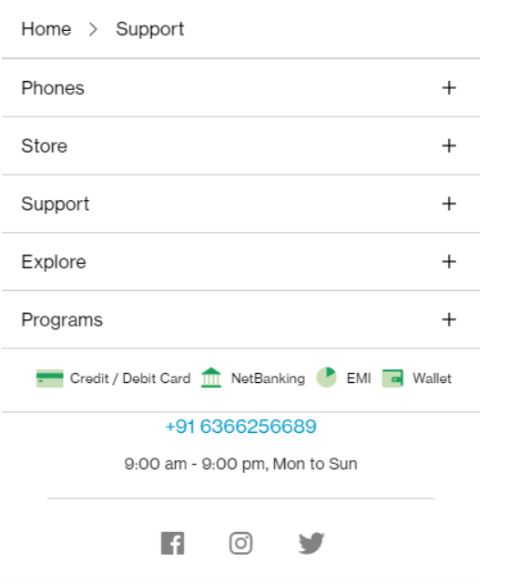


# 5. Webiste Name: [Samsung](https://www.samsung.com/in/offer/online/samsung-fest/)

### Topics

       getElementById, createElement, InnerText, append, setAttribute

### Sample Image


### Tasks

     Target the main div of card and change the Button text to Check out

### Output


### Code
```
const checkout = document.querySelectorAll(".feature-column-carousel__button .cta")

for(let checkout of checkout) {
    checkout.innerText = "Check out"
}
```

### Result
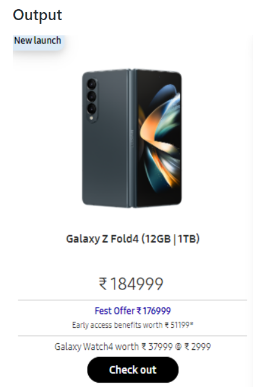

# 6. Webiste Name: [Adidas](https://www.adidas.co.in/)

### Topics

    -   Query Selector, Event listeners, Changing Styles

### Sample Image


### Tasks

     Target the search box and on hover change thebackground color to red.

### Output


### code

```
const searchElement = document.querySelector(".searchinput___19uW0")

searchElement.addEventListener('mouseover', function (){
    searchElement.style.backgroundColor = "red";
});

```
### Result


# 7. Webiste Name: [MDN Web Docs](https://developer.mozilla.org/en-US/)

### Topics

       Form, Value, Submit

### Sample Image


### Tasks

     To Search a topic in the MDN Search bar.
     First add a text to search in the search bar and then hit the submit search button to search the docs using DOM

### Output


### code

```
const search = "CSS Positions";


const searchElement = document.getElementById("hp-search-input");
searchElement.value = search;

const formElement = document.querySelector("#hp-search-form")

formElement.submit();

```
### Result
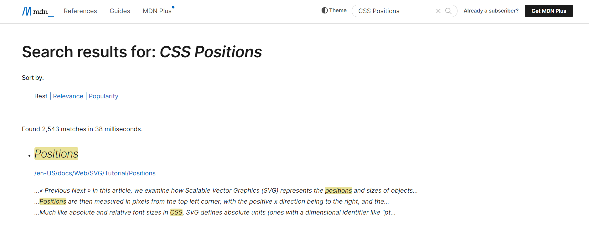

# 8. Webiste Name: [Google](https://www.google.com/)

### Topics

       Remove Elements

### Sample Image


### Tasks

     Remove alternate languages from the home page languages listed

### Output


### code
```
const languages = document.getElementById("SIvCob");

const languagesList = document.querySelectorAll("#SIvCob a");

languagesList.forEach((i, j)=>{
    let index = j + 1;

    // remove odd element
    if(index % 2 !== 0) {
        languages.removeChild(i);
    }
})

```
### Result
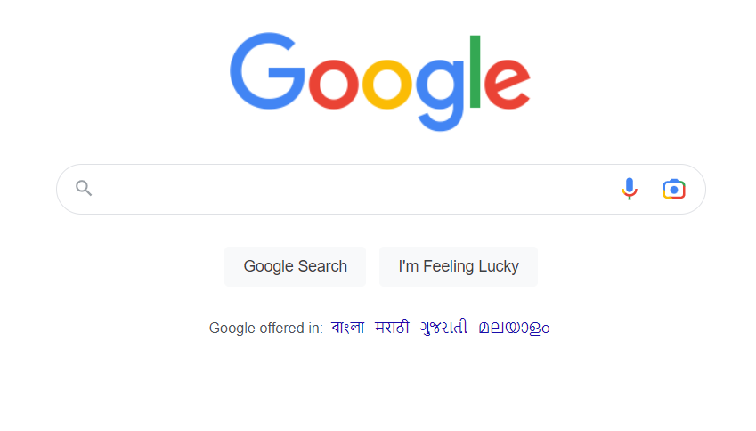

# 9. Webiste Name: [Code Wars](https://www.codewars.com/)

### Topics

       Change Font Family, Color of Text.

### Sample Image


### Tasks

    Change the font family of the text to monospace and text color to the logo’s background color.

### Output


### code
```
const headingElement = document.querySelector("h1.display-heading-1");

headingElement.style.fontFamily = "monospace";
headingElement.style.color = "red";
```
### Result
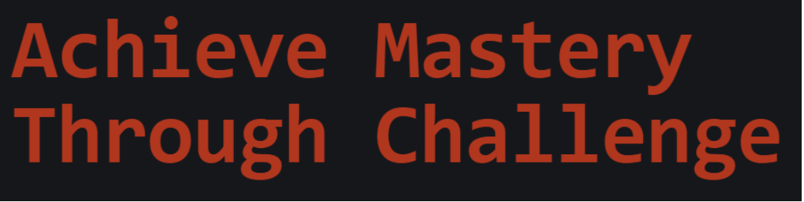

# 10. Webiste Name: [Freecodecamp](https://www.freecodecamp.org/)

### Topics

       querySelector, mouseover, click eventListener,  callback function, style,

### Sample Image


### Tasks

    Target the button and change background colour on mouseover

### Output


### code
```
const button = document.querySelector(".signup-btn.btn-cta-big");

const btnText = button.querySelector(".signup-btn.btn-cta-big .login-btn-text")

button.addEventListener("mouseover", function(){
   btnText.style.backgroundColor = "red";
});
```
### Result
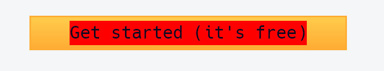

# 11. Webiste Name: [realme](https://www.realme.com/in/)

### Topics

       querySelector,style,background-image

### Sample Image


### Tasks

    change the realme logo to ineuron logo

### Output


### code

```
const iNeuronLogoPath = "https://ineuron.ai/Images/ineuron-logo.png";

const logo = document.querySelector("a.logo.gtag .icon-logo")

logo.style.backgroundImage = `url(${iNeuronLogoPath})`;

```
### Result
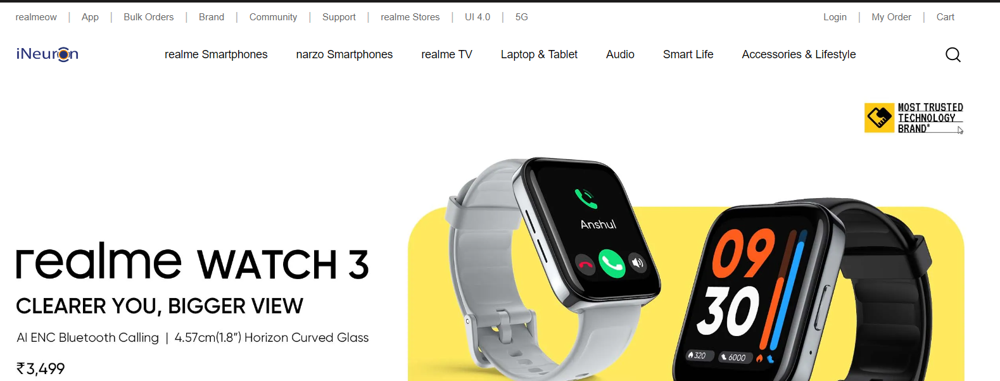

# 12. Webiste Name: [Github](https://github.com/)

### Topics

       querySelector,style,background-Color

### Sample Image


### Tasks

     change the background colour of the button to blue.

### Output


### code

```
const btn = document.querySelector(".js-repos-container a");

btn.style.backgroundColor = "blue";
```
### Result
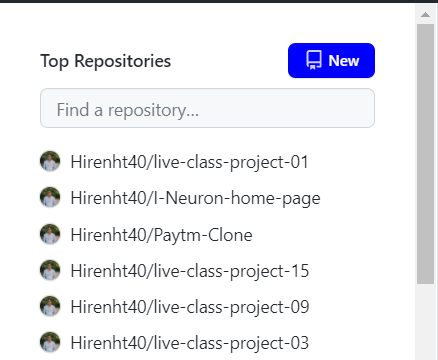

# 13. Webiste Name: [Hackerrank](https://www.hackerrank.com/)

### Topics

       querySelector,innerHtml

### Sample Image


### Tasks

Target the top description and change “Matching developers with great companies” to ‘JSBOOTCAMP“.

### Output


### code

```
document.querySelector(".fl-heading-text").innerHTML = "JSBOOTCAMP"
```
### Result
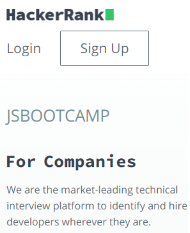


# 14. Webiste Name: [Asus](https://www.asus.com/in/)

### Topics

      querySelector,style,font-size

### Sample Image


### Tasks

       change the fontsize of “Hot Deals” to 80px

### Output


### code

```
document.querySelector(".HotDealsAll__Heading__2fIbe").style.fontSize = "80px";
```

### Result
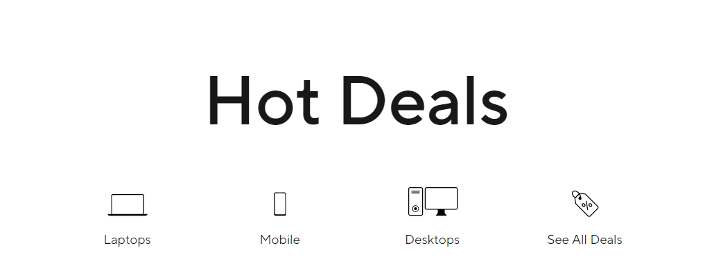

# 15. Webiste Name: [Dell](https://www.dell.com/en-in/shop/deals/laptop-deals?gacd=10415953-9016-5761040-285981356-0&dgc=ST&gclid=Cj0KCQjwguGYBhDRARIsAHgRm4-XUDMhhVNyHXb3s1gY4ZBzORr_d9Se-buhJwy7asyUe7YdqEA11eEaAt6UEALw_wcB&gclsrc=aw.ds&nclid=BxjBlpBQsX6pjSHh-L8YYSU77EpfXRkG1AGMB5Wbeu386ykspfrPDnfx_DdFau20)

### Topics

      querySelector,style.textAlign

### Sample Image


### Tasks

       Convert the text “G15 Gaming Laptop” from left to right

### Output


### code

```
const laptop = document.querySelector("#d560824win9b");

const title = laptop.querySelector(".ps-top .ps-title")

title.style.textAlign = "right";
```
### Result


# 16. Webiste Name: [Vercel](https://vercel.com/)

### Topics

     querySelector,innerHTMl

### Sample Image


### Tasks

      change the heading “Start with the developer” to “Start with Scratch”

### Output


### code

```
document.querySelector(".section-title_title__VEDfK").innerHTML = "Start with Scratch";
```
### Result
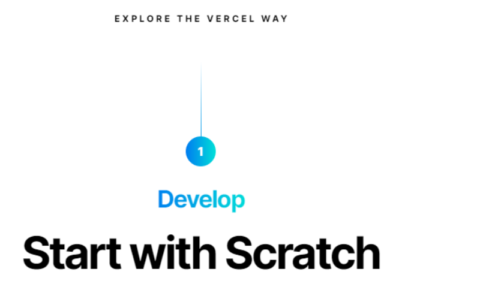

# 17. Webiste Name: [Sony](https://www.sony.co.in/)

### Topics

    querySelector,innerHTMl

### Sample Image


### Tasks

     change the button text To current Date.

### Output


### code

```
document.querySelector(".btn.buy.buy-button").innerHTML = new Date().toString();
```
### Result
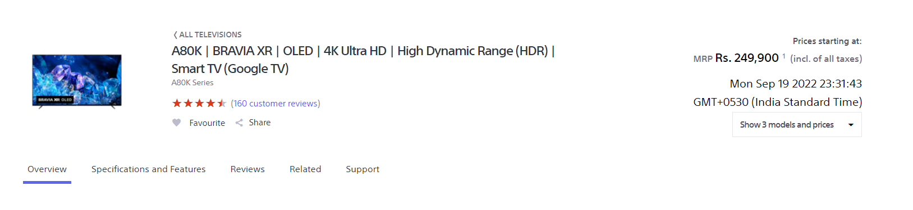

# 18. Webiste Name: [Philips](https://www.philips.co.in/)

### Topics

     querySelector,style,backgroundcolor

### Sample Image


### Tasks

    change the background colour blue to orange

### Output


### code

```
document.querySelector(".p-f03-footer-container").style.background = "orange";
```
### Result
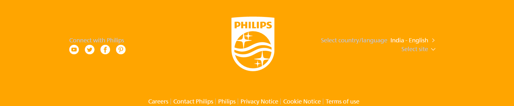


# 19. Webiste Name: [Canon](https://in.canon/)

### Topics

          querySelector,src

### Sample Image


### Tasks

    extract the canon logo

### Output


### code

```
document.querySelector(".logo").getAttribute("src");
```
### Result
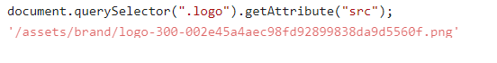

# 20. Webiste Name: [Oppo](https://www.oppo.com/in/)

### Topics

          querySelector,style,color

### Sample Image


### Tasks

      Change the description colour black to orange

### Output


### code

```
document.querySelector(".wide h3.desc").style.color = "orange";

```
### Result
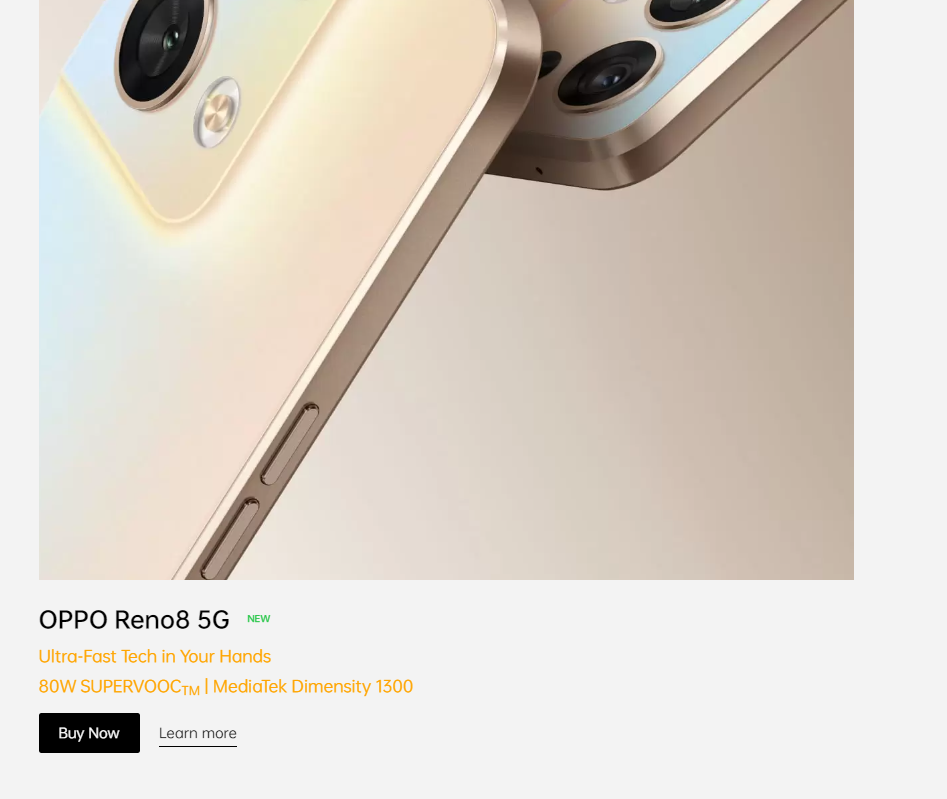

